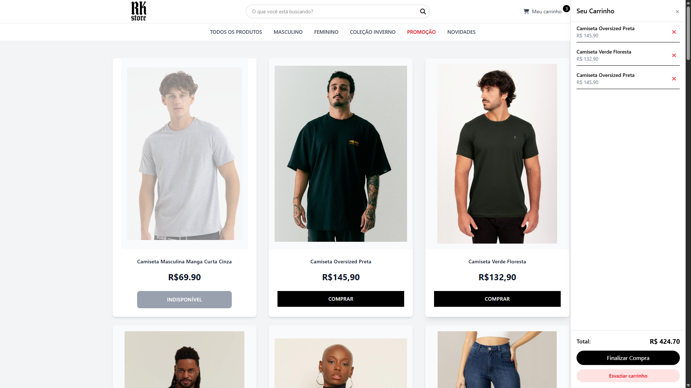

# 🛍️ RK Store — Loja Virtual com Carrinho e Estoque Dinâmico

Loja virtual fictícia com sistema de carrinho, controle de estoque e persistência no `localStorage`, tudo desenvolvido com **HTML**, **TailwindCSS** e **JavaScript Vanilla**.

---

## 🚀 Funcionalidades

- 🛒 Carrinho de compras com painel lateral (popup)
- 📦 Controle de estoque
- 🔍 Filtro por categoria e barra de pesquisa
- 💾 Persistência de dados com `localStorage`

---

## 📸 Demonstração

- Página inicial


- Carrinho de compras



---

## 🧑‍💻 Tecnologias utilizadas

- HTML5 + CSS3
- TailwindCSS
- JavaScript (Vanilla)
- FontAwesome (ícones)
- LocalStorage

---

## 📦 Como rodar localmente

1. Clone o repositório:

```bash
git clone https://github.com/seu-usuario/rk-store.git
```

2. Abra a pasta do arquivo no VSCode e utilize o Live Server no index.html

---

## 📄 Licença

Este projeto é de uso livre para fins educacionais.
